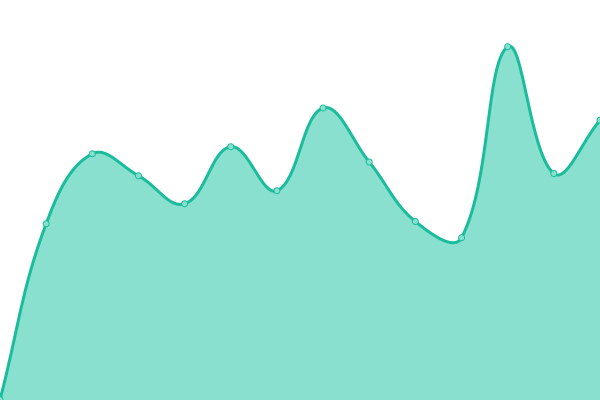
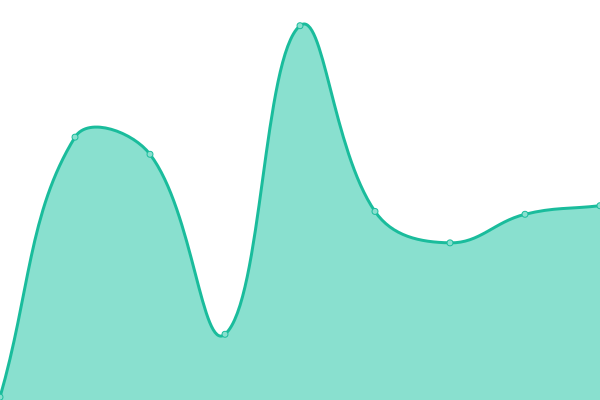
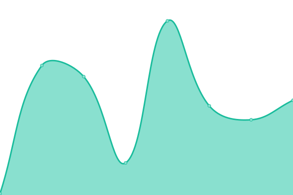
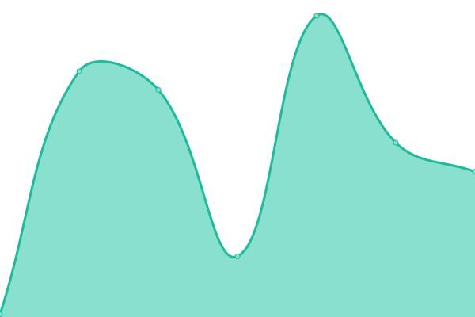

# [📈 Live Status](https://nimbus9inc.github.io/api-monitor): <!--live status--> **🟩 All systems operational**

This repository contains the open-source uptime monitor and status page for [nimbus9inc](https://nimbus9inc.github.io/api-monitor), powered by [Upptime](https://github.com/upptime/upptime).

With [Upptime](https://upptime.js.org), you can get your own unlimited and free uptime monitor and status page, powered entirely by a GitHub repository. We use [Issues](https://github.com/nimbus9inc/api-monitor/issues) as incident reports, [Actions](https://github.com/nimbus9inc/api-monitor/actions) as uptime monitors, and [Pages](https://nimbus9inc.github.io/api-monitor) for the status page.

<!--start: status pages-->
<!-- This summary is generated by Upptime (https://github.com/upptime/upptime) -->
<!-- Do not edit this manually, your changes will be overwritten -->
<!-- prettier-ignore -->
| URL | Status | History | Response Time | Uptime |
| --- | ------ | ------- | ------------- | ------ |
|  [Nimbus9 Marketing Site](https://nimbusnine.co) | 🟩 Up | [nimbus9-marketing-site.yml](https://github.com/nimbus9inc/api-monitor/commits/HEAD/history/nimbus9-marketing-site.yml) | 

 633ms
     
 | 

<a href="https://status.nimbus9.io/history/nimbus9-marketing-site">100.00%</a>
    

|  [Nimbus9 API Documentation](https://api.nimbus9.io) | 🟩 Up | [nimbus9-api-documentation.yml](https://github.com/nimbus9inc/api-monitor/commits/HEAD/history/nimbus9-api-documentation.yml) | 

 676ms
     
 | 

<a href="https://status.nimbus9.io/history/nimbus9-api-documentation">100.00%</a>
    

|  [Unifi Enterprise](https://unifi-enterprise.nimbus9.io) | 🟩 Up | [unifi-enterprise.yml](https://github.com/nimbus9inc/api-monitor/commits/HEAD/history/unifi-enterprise.yml) | 

 524ms
     
 | 

<a href="https://status.nimbus9.io/history/unifi-enterprise">100.00%</a>
    

|  [Environment Quality Management](https://eqm.nimbus9.io) | 🟩 Up | [environment-quality-management.yml](https://github.com/nimbus9inc/api-monitor/commits/HEAD/history/environment-quality-management.yml) | 

 378ms
     
 | 

<a href="https://status.nimbus9.io/history/environment-quality-management">100.00%</a>
    

|  [Site Admin Panel](https://admin.nimbus9.io) | 🟩 Up | [site-admin-panel.yml](https://github.com/nimbus9inc/api-monitor/commits/HEAD/history/site-admin-panel.yml) | 

 431ms
     
 | 

<a href="https://status.nimbus9.io/history/site-admin-panel">100.00%</a>
    

|  [Partner Quoting Tool](https://quote.nimbus9.io) | 🟩 Up | [partner-quoting-tool.yml](https://github.com/nimbus9inc/api-monitor/commits/HEAD/history/partner-quoting-tool.yml) | 

 375ms
     
 | 

<a href="https://status.nimbus9.io/history/partner-quoting-tool">100.00%</a>
    

|  [Nimbus9 SSO](https://sso.nimbus9.io) | 🟩 Up | [nimbus9-sso.yml](https://github.com/nimbus9inc/api-monitor/commits/HEAD/history/nimbus9-sso.yml) | 

 444ms
     
 | 

<a href="https://status.nimbus9.io/history/nimbus9-sso">100.00%</a>
    

|  [Nimbus9 Auth API](https://api.nimbus9.io/v2/auth/health) | 🟩 Up | [nimbus9-auth-api.yml](https://github.com/nimbus9inc/api-monitor/commits/HEAD/history/nimbus9-auth-api.yml) | 

 236ms
     
 | 

<a href="https://status.nimbus9.io/history/nimbus9-auth-api">100.00%</a>
    

|  [Nimbus9 Automated Demand Response API](https://api.nimbus9.io/v2/adr/health) | 🟩 Up | [nimbus9-automated-demand-response-api.yml](https://github.com/nimbus9inc/api-monitor/commits/HEAD/history/nimbus9-automated-demand-response-api.yml) | 

 59ms
     
 | 

<a href="https://status.nimbus9.io/history/nimbus9-automated-demand-response-api">100.00%</a>
    

|  [Nimbus9 Audit API](https://api.nimbus9.io/v2/audit/health) | 🟩 Up | [nimbus9-audit-api.yml](https://github.com/nimbus9inc/api-monitor/commits/HEAD/history/nimbus9-audit-api.yml) | 

 60ms
     
 | 

<a href="https://status.nimbus9.io/history/nimbus9-audit-api">100.00%</a>
    

|  [Nimbus9 Billing API](https://api.nimbus9.io/v2/billing/health) | 🟩 Up | [nimbus9-billing-api.yml](https://github.com/nimbus9inc/api-monitor/commits/HEAD/history/nimbus9-billing-api.yml) | 

 60ms
     
 | 

<a href="https://status.nimbus9.io/history/nimbus9-billing-api">100.00%</a>
    

|  [Nimbus9 Device Commissioning API](https://api.nimbus9.io/v2/commission/health) | 🟩 Up | [nimbus9-device-commissioning-api.yml](https://github.com/nimbus9inc/api-monitor/commits/HEAD/history/nimbus9-device-commissioning-api.yml) | 

 60ms
     
 | 

<a href="https://status.nimbus9.io/history/nimbus9-device-commissioning-api">100.00%</a>
    

|  [Nimbus9 Device Control API](https://api.nimbus9.io/v2/control/health) | 🟩 Up | [nimbus9-device-control-api.yml](https://github.com/nimbus9inc/api-monitor/commits/HEAD/history/nimbus9-device-control-api.yml) | 

 60ms
     
 | 

<a href="https://status.nimbus9.io/history/nimbus9-device-control-api">100.00%</a>
    

|  [Nimbus9 Event->Condition->Action API](https://api.nimbus9.io/v2/eca/health) | 🟩 Up | [nimbus9-event-condition-action-api.yml](https://github.com/nimbus9inc/api-monitor/commits/HEAD/history/nimbus9-event-condition-action-api.yml) | 

 61ms
     
 | 

<a href="https://status.nimbus9.io/history/nimbus9-event-condition-action-api">100.00%</a>
    

|  [Nimbus9 Floor Plan API](https://api.nimbus9.io/v2/floor-plan/health) | 🟩 Up | [nimbus9-floor-plan-api.yml](https://github.com/nimbus9inc/api-monitor/commits/HEAD/history/nimbus9-floor-plan-api.yml) | 

 60ms
     
 | 

<a href="https://status.nimbus9.io/history/nimbus9-floor-plan-api">100.00%</a>
    

|  [Nimbus9 HVAC API](https://api.nimbus9.io/v2/hvac/health) | 🟩 Up | [nimbus9-hvac-api.yml](https://github.com/nimbus9inc/api-monitor/commits/HEAD/history/nimbus9-hvac-api.yml) | 

 60ms
     
 | 

<a href="https://status.nimbus9.io/history/nimbus9-hvac-api">100.00%</a>
    

|  [Nimbus9 Metrics API](https://api.nimbus9.io/v2/metrics/health) | 🟩 Up | [nimbus9-metrics-api.yml](https://github.com/nimbus9inc/api-monitor/commits/HEAD/history/nimbus9-metrics-api.yml) | 

 62ms
     
 | 

<a href="https://status.nimbus9.io/history/nimbus9-metrics-api">100.00%</a>
    

|  [Nimbus9 Notification API](https://api.nimbus9.io/v2/notification/health) | 🟩 Up | [nimbus9-notification-api.yml](https://github.com/nimbus9inc/api-monitor/commits/HEAD/history/nimbus9-notification-api.yml) | 

 59ms
     
 | 

<a href="https://status.nimbus9.io/history/nimbus9-notification-api">100.00%</a>
    

|  [Nimbus9 Passport API](https://api.nimbus9.io/v2/passport/health) | 🟩 Up | [nimbus9-passport-api.yml](https://github.com/nimbus9inc/api-monitor/commits/HEAD/history/nimbus9-passport-api.yml) | 

 60ms
     
 | 

<a href="https://status.nimbus9.io/history/nimbus9-passport-api">100.00%</a>
    

|  [Nimbus9 Quote API](https://api.nimbus9.io/v2/quote/health) | 🟩 Up | [nimbus9-quote-api.yml](https://github.com/nimbus9inc/api-monitor/commits/HEAD/history/nimbus9-quote-api.yml) | 

 60ms
     
 | 

<a href="https://status.nimbus9.io/history/nimbus9-quote-api">100.00%</a>
    

|  [Nimbus9 Real-time Update API](https://api.nimbus9.io/v2/update/health) | 🟩 Up | [nimbus9-real-time-update-api.yml](https://github.com/nimbus9inc/api-monitor/commits/HEAD/history/nimbus9-real-time-update-api.yml) | 

 60ms
     
 | 

<a href="https://status.nimbus9.io/history/nimbus9-real-time-update-api">100.00%</a>
    

|  [Nimbus9 Reporting API](https://api.nimbus9.io/v2/report/health) | 🟩 Up | [nimbus9-reporting-api.yml](https://github.com/nimbus9inc/api-monitor/commits/HEAD/history/nimbus9-reporting-api.yml) | 

 60ms
     
 | 

<a href="https://status.nimbus9.io/history/nimbus9-reporting-api">100.00%</a>
    

|  [Nimbus9 Routine Schedule API](https://api.nimbus9.io/v2/astro/health) | 🟩 Up | [nimbus9-routine-schedule-api.yml](https://github.com/nimbus9inc/api-monitor/commits/HEAD/history/nimbus9-routine-schedule-api.yml) | 

 60ms
     
 | 

<a href="https://status.nimbus9.io/history/nimbus9-routine-schedule-api">100.00%</a>
    

|  [Nimbus9 Smart Control API](https://api.nimbus9.io/v2/smart-control/health) | 🟩 Up | [nimbus9-smart-control-api.yml](https://github.com/nimbus9inc/api-monitor/commits/HEAD/history/nimbus9-smart-control-api.yml) | 

 59ms
     
 | 

<a href="https://status.nimbus9.io/history/nimbus9-smart-control-api">100.00%</a>
    

|  [Nimbus9 Switch/Sensor API](https://api.nimbus9.io/v2/switch-sensor/health) | 🟩 Up | [nimbus9-switch-sensor-api.yml](https://github.com/nimbus9inc/api-monitor/commits/HEAD/history/nimbus9-switch-sensor-api.yml) | 

 60ms
     
 | 

<a href="https://status.nimbus9.io/history/nimbus9-switch-sensor-api">100.00%</a>
    

<!--end: status pages-->

[**Visit our status website →**](https://nimbus9inc.github.io/api-monitor)

## 📄 License

- Powered by: [Upptime](https://github.com/upptime/upptime)
- Code: [MIT](./LICENSE) © [nimbus9inc](https://nimbus9inc.github.io/api-monitor)
- Data in the `./history` directory: [Open Database License](https://opendatacommons.org/licenses/odbl/1-0/)
